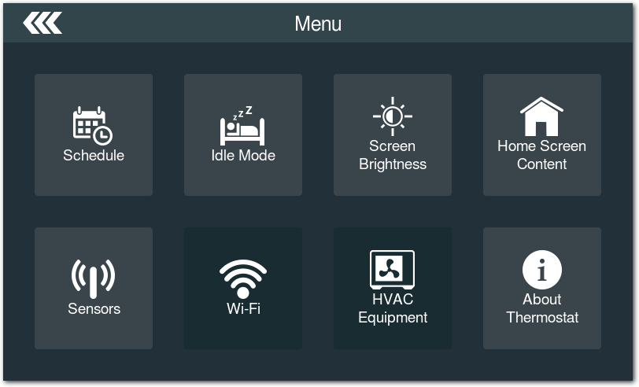
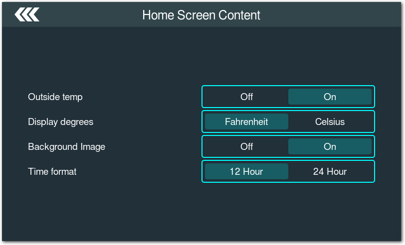

# EGT Thermostat Demo Application

Thermostat demonstration using the [Ensemble Graphics Toolkit (EGT)](https://github.com/linux4sam/egt).

## Features

- Basic Automatic/Cooling/Heating/Off modes.
- Fan setting.
- Live camera feed on the main screen.
- Minimal weekly scheduling.
- Support for temp sensors through libsensors, like the [Thermo 5 Click Board](https://www.mikroe.com/thermo-5-click).
- Settings, HVAC status, and sensors saved to an sqlite3 database.
- Idle/sleep screen and state, with screen brightness settings.
- Get outside temp/weather icon based on zip code.
- Configurable background on main screen.

## Screenshot






# Compiling

Install necessary egt dependencies by referring to the egt project README.md.

Also, install some thermostat dependencies.

```sh
sudo apt install sqlite3
```

Compile and install libegt to a directory. Then, configure

```sh
git clone --recursive https://github.com/linux4sam/egt-thermostat.git
cd egt-thermostat
./autogen.sh
```

Depending on your egt path the next step could be:
```sh
CXXFLAGS="-I/opt/egt/include/" \
LDFLAGS="-L/opt/egt/lib/" \
PKG_CONFIG_PATH=/opt/egt/lib/pkgconfig \
./configure
```

**or**

```sh
CXXFLAGS="-I/usr/local/include/" \
LDFLAGS="-L/usr/local/lib/" \
PKG_CONFIG_PATH=/usr/local/lib/pkgconfig \
./configure
```

& then build this project
```sh
make
```

Create a default database.

```sh
sqlite3 thermostat.db < thermostat.sql
```

Then, run.

```sh
./egt-thermostat
```

## License

Released under the terms of the `Apache 2` license. See the [COPYING](COPYING)
file for more information.
