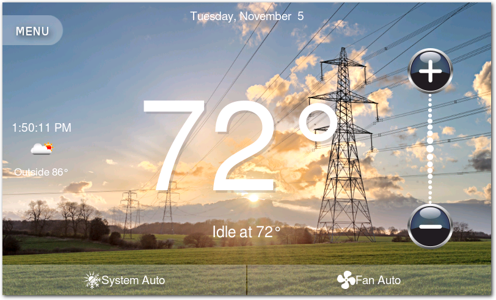

# EGT Thermostat Demo Application

Thermostat demoonstration using the [Ensemble Graphics Toolkit (EGT)](https://github.com/linux4sam/egt).

## Features

- Basic Automatic/Cooling/Heating/Off modes.
- Minimal weekly scheduling.
- [Thermo 5 Click Board](https://www.mikroe.com/thermo-5-click)
- libsensors to read temperature.
- Settings saved to an sqlite3 database.
- Screen sleep state.  Hardware screen brightness is controlled when in and out of sleep mode.
- Get outside temp/weather icon based on zip code.
- NTP client.

## License

Released under the terms of the `Apache 2` license. See the [COPYING](COPYING)
file for more information.
